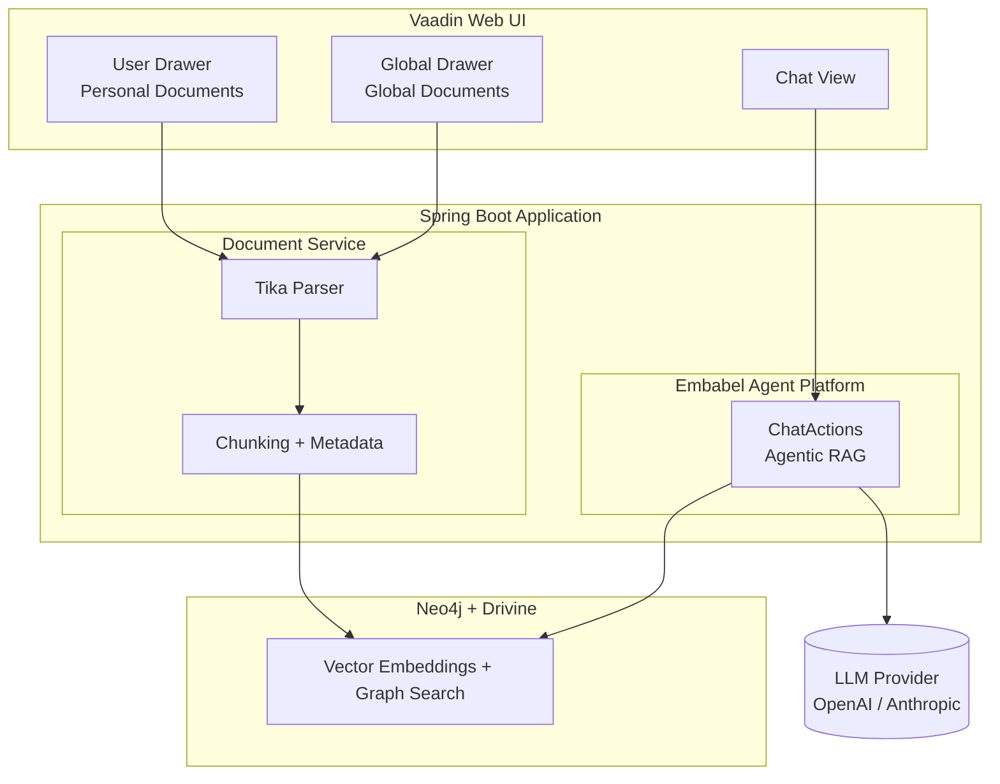
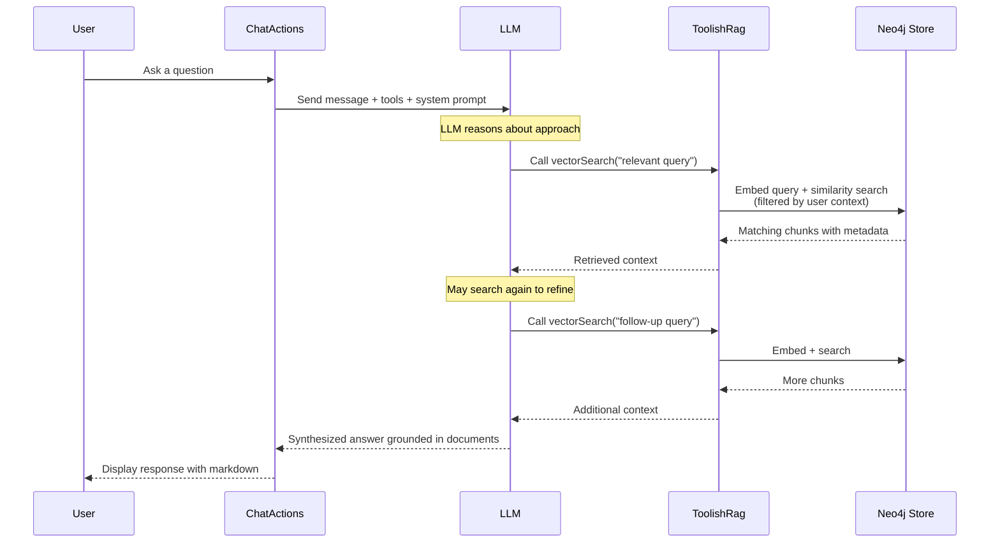
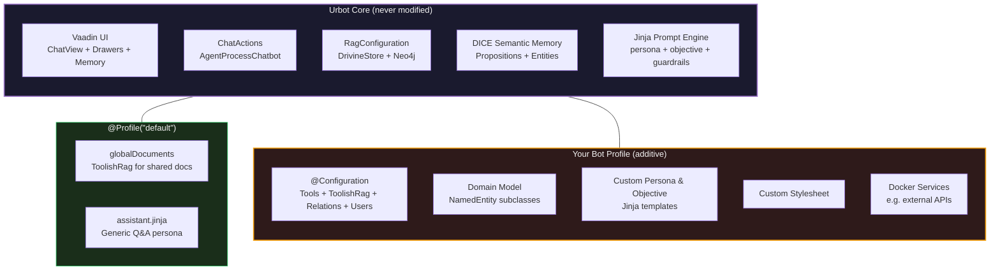

&nbsp;&nbsp;&nbsp;&nbsp;

&nbsp;&nbsp;&nbsp;&nbsp;

# Urbot

> **Template repository** -- Use this as a starting point for building your own RAG chatbot with the [Embabel Agent Framework](https://embabel.com). Click **"Use this template"** on GitHub to create your own copy.

**A RAG-powered document chatbot with a Vaadin web interface, built on the [Embabel Agent Framework](https://embabel.com).**

Upload documents, ask questions, and get intelligent answers grounded in your content -- powered by agentic Retrieval-Augmented Generation with Neo4j graph-backed vector search.

Urbot is designed to be **extended without modification**. The core application provides the full RAG infrastructure, Vaadin UI, memory system, and chat plumbing out of the box. To build your own chatbot, you add a Spring profile with your persona, domain model, tools, and styling -- all in a separate package, without touching any existing code. See [Custom Chatbot Profiles](#custom-chatbot-profiles) below.

---

## Architecture



## How Agentic RAG Works

Unlike traditional RAG pipelines where retrieval is a fixed preprocessing step, Urbot uses the **Embabel Agent Framework's Utility AI pattern** to make retrieval _agentic_. The LLM autonomously decides when and how to search your documents.



Key aspects of the agentic approach:

- **Autonomous tool use** -- The LLM decides _whether_ to search and _what_ to search for
- **Iterative retrieval** -- Multiple searches can refine results before answering
- **Context-aware filtering** -- Results are scoped to the user's current workspace context
- **Template-driven prompts** -- Jinja2 templates separate persona, objective, and guardrails

## Document Contexts

Urbot supports two document scopes:

| Scope | Access | Ingestion | Description |
|---|---|---|---|
| **Personal** | Per-user context | User Drawer (click profile) | Documents scoped to a user's named context (e.g. `2_personal`). Users can create and switch between multiple contexts. |
| **Global** | Shared across all users | Global Drawer (`...` toggle) | Documents available to everyone, stored under the `global` context. |

RAG search filters results to the user's current effective context, so personal and global documents are searched independently based on which context is active.

## Technology Stack

| Layer | Technology | Role |
|---|---|---|
| **UI** | [Vaadin 24](https://vaadin.com/) | Server-side Java web framework with real-time push updates |
| **Backend** | [Spring Boot 3](https://spring.io/projects/spring-boot) | Application framework, dependency injection, security |
| **Agent Framework** | [Embabel Agent](https://embabel.com) | Agentic AI orchestration with Utility AI pattern |
| **Graph + Vector Store** | [Neo4j](https://neo4j.com/) via [Drivine](https://github.com/liberation-data/drivine) | Graph-backed vector embeddings, semantic search, and document relationships |
| **Document Parsing** | [Apache Tika](https://tika.apache.org/) | Extract text from PDF, DOCX, HTML, and 1000+ formats |
| **LLM** | OpenAI / Anthropic | Chat completion and text embedding models |
| **Auth** | Spring Security | Form-based authentication with role-based access |

### Embabel Agent Framework

Urbot is built on the [Embabel Agent Framework](https://embabel.com), which provides:

- **`AgentProcessChatbot`** -- Wires actions into a conversational agent using the Utility AI pattern, where the LLM autonomously selects which `@Action` methods to invoke
- **`ToolishRag`** -- Exposes vector search as an LLM-callable tool, enabling agentic retrieval
- **`DrivineStore`** -- Neo4j-backed RAG store with vector indexes and graph relationships (Lucene and pgvector backends are also available)
- **Jinja2 prompt templates** -- Composable system prompts with persona/objective/guardrails separation

### Vaadin UI

The frontend is built entirely in server-side Java using Vaadin Flow:

- **ChatView** -- Main chat interface with message bubbles, markdown rendering, and real-time tool call progress indicators
- **UserDrawer** -- Click the profile chip to manage personal documents, switch contexts, and log out
- **DocumentsDrawer** -- Right-side toggle panel for uploading and managing global documents
- **Dark theme** -- Custom Lumo theme with responsive design
- **Push updates** -- Async responses stream to the browser via long polling

### Neo4j Vector Store

Documents are chunked, embedded, and stored in Neo4j via Drivine:

- **Chunking** -- 800-character chunks with 100-character overlap for context continuity
- **Embeddings** -- Generated via OpenAI `text-embedding-3-small` (configurable)
- **Metadata filtering** -- Chunks tagged with user/context metadata for scoped search
- **Graph relationships** -- Document → section → chunk hierarchy preserved as graph edges
- **Persistent storage** -- Neo4j container via Docker Compose, survives restarts

## Features

- **Document upload** -- PDF, DOCX, XLSX, TXT, MD, HTML, ODT, RTF (up to 10MB)
- **URL ingestion** -- Fetch and index web pages directly
- **Personal & global documents** -- Personal documents scoped per user context; global documents shared across all users
- **Multi-context workspaces** -- Create and switch between named contexts to organize personal documents
- **Markdown chat** -- Responses render with full markdown and code highlighting
- **Tool call visibility** -- See real-time progress as the agent searches your documents
- **Session persistence** -- Conversation history preserved across page reloads
- **Configurable persona** -- Switch voice and objective via configuration
- **Custom chatbot profiles** -- Activate a Spring profile to replace the entire persona, domain model, tools, and RAG configuration

## Custom Chatbot Profiles

Urbot is an extensible template. You never need to modify the core application code -- instead, you add your own package alongside it and activate it with a Spring profile. The base application provides RAG infrastructure, Vaadin UI, DICE semantic memory, and chat plumbing; your profile adds a persona, domain model, tools, stylesheet, and `ToolishRag` configuration to create an entirely different chatbot.

When no profile is set, the `default` profile is active and Urbot runs as a generic document Q&A assistant with the built-in `globalDocuments` `ToolishRag` bean. When a profile is activated, that default bean is skipped (via `@Profile("default")`) and the profile's `@Configuration` class provides its own `ToolishRag` and any other beans it needs.



### How It Works

Each custom chatbot lives in its own package (e.g. `com.embabel.bot.astrid`) and provides:

| Axis | Mechanism | Example |
|---|---|---|
| **Properties** | `application-<profile>.properties` overrides persona, objective, LLM model, temperature, stylesheet | `urbot.chat.persona=astrid` |
| **Persona & Objective** | Jinja templates in `prompts/personas/<name>.jinja` and `prompts/objectives/<name>.jinja` | Astrid's warm astrologer voice |
| **Domain Model** | `NamedEntity` subclasses scoped via `urbot.bot-packages` -- automatically added to the DICE data dictionary for entity extraction | `Pet`, `Band`, `Goal`, `Place`, ... |
| **Relationships** | A `Relations` bean defines how entities connect (e.g. user _owns_ Pet, user _listens to_ Band) | `Relations.empty().withSemanticBetween(...)` |
| **Tools** | `@LlmTool` classes, `Subagent` beans, `ToolishRag` beans -- all auto-discovered | `AstrologyTools`, `DailyHoroscopeAgent` |
| **ToolishRag** | Profile-specific `ToolishRag` bean replaces the default `globalDocuments` | `astrologyDocuments` scoped to global context |
| **Users** | `@Primary UrbotUserService` bean overrides the default user list | Different demo users per bot |
| **Stylesheet** | `urbot.stylesheet=<name>` loads `themes/urbot/<name>.css` | Custom color palette and branding |
| **Docker services** | Profile-specific compose services (e.g. an astrology API container) | `docker compose --profile astrology up` |

### Example: Astrid (astrology chatbot)

The `astrid` branch demonstrates a complete custom chatbot:

```bash
# Activate the Astrid profile
mvn spring-boot:run -Dspring-boot.run.profiles=astrid
```

This activates:

- **`application-astrid.properties`** -- sets persona, objective, temperature, stylesheet, and bot package
- **`AstridConfiguration`** -- defines domain relationships, a custom `ToolishRag` for astrology documents, a `DailyHoroscopeAgent` subagent, and custom users
- **`AstrologyTools`** -- `@LlmTool` methods wrapping a Swiss Ephemeris API for natal charts and transits
- **Domain classes** (`Pet`, `Band`, `Book`, `Goal`, `Place`, ...) -- enriched entity extraction from conversation
- **`astrid.jinja`** persona -- an Australian astrologer who speaks casually and believes the stars explain life
- **`astrid.css`** -- custom theme overrides

### Creating Your Own Bot

1. Create a package under `src/main/java/com/embabel/bot/<yourbot>/`
2. Add a `@Configuration` class with your beans (tools, `ToolishRag`, domain relations, users)
3. Add `application-<yourbot>.properties` with `urbot.bot-packages=com.embabel.bot.<yourbot>` and your persona/objective names
4. Add Jinja templates under `prompts/personas/` and `prompts/objectives/`
5. Run with `mvn spring-boot:run -Dspring-boot.run.profiles=<yourbot>`

See `src/main/java/com/embabel/bot/README.md` for the full extension reference.

## Project Structure

```
src/main/java/
├── com/embabel/urbot/               # Core application
│   ├── UrbotApplication.java           # Spring Boot entry point + Drivine bootstrap
│   ├── ChatActions.java                # @Action methods for agentic RAG chat
│   ├── ChatConfiguration.java          # Utility AI chatbot wiring
│   ├── UrbotProperties.java            # Externalized configuration
│   ├── rag/
│   │   ├── RagConfiguration.java       # Neo4j/Drivine vector store + default ToolishRag
│   │   └── DocumentService.java        # Document ingestion, context management
│   ├── security/
│   │   ├── SecurityConfiguration.java  # Spring Security setup
│   │   └── LoginView.java              # Login page
│   ├── user/
│   │   ├── UrbotUser.java              # User model with context
│   │   └── UrbotUserService.java       # User service interface
│   └── vaadin/
│       ├── ChatView.java               # Main chat interface
│       ├── ChatMessageBubble.java      # User/assistant message rendering
│       ├── DocumentsDrawer.java        # Global document management panel
│       ├── UserDrawer.java             # Personal document management + context selector
│       ├── DocumentListSection.java    # Document list component
│       ├── FileUploadSection.java      # File upload component (reusable)
│       ├── UrlIngestSection.java       # URL ingestion component (reusable)
│       ├── UserSection.java            # Clickable user profile chip
│       └── Footer.java                 # Document/chunk statistics
└── com/embabel/bot/                  # Custom chatbot profiles (profile-gated)
    └── <yourbot>/                      # e.g. astrid/
        ├── <YourBot>Configuration.java # @Configuration with tools, ToolishRag, domain relations
        ├── <YourBot>Tools.java         # @LlmTool methods
        └── domain/                     # NamedEntity subclasses for DICE extraction

src/main/resources/
├── application.yml                     # Base config (server, LLM, Neo4j, chunking)
├── application-<profile>.properties    # Profile overrides (persona, objective, bot-packages)
└── prompts/
    ├── urbot.jinja                     # Main prompt template
    ├── elements/
    │   ├── guardrails.jinja            # Safety guidelines
    │   └── personalization.jinja       # Dynamic persona/objective loader
    ├── personas/
    │   ├── assistant.jinja             # Default assistant persona
    │   └── <yourbot>.jinja             # Custom persona per profile
    └── objectives/
        ├── general.jinja               # Default knowledge base objective
        └── <yourbot>.jinja             # Custom objective per profile

docker-compose.yml                      # Neo4j + optional profile-specific services
```

## Getting Started

### Prerequisites

- Java 21+
- Maven 3.9+
- Docker (for Neo4j)
- An OpenAI or Anthropic API key
- (Optional) A [Brave Search API key](https://brave.com/search/api/) for web search via MCP

### Run (Default Mode)

```bash
# Start Neo4j
docker compose up -d

# Set your API key
export OPENAI_API_KEY=sk-...    # or ANTHROPIC_API_KEY for Claude

# Optional: enable Brave web search MCP tool
export BRAVE_API_KEY=BSA...

# Start the application (default generic document Q&A assistant)
mvn spring-boot:run
```

To run with a custom chatbot profile instead:

```bash
mvn spring-boot:run -Dspring-boot.run.profiles=astrid
```

Open [http://localhost:9000](http://localhost:9000) and log in:

| Username | Password | Roles |
|---|---|---|
| `admin` | `admin` | ADMIN, USER |
| `user` | `user` | USER |

### Upload Documents and Chat

1. Click your **profile chip** (top right) to open the personal documents drawer -- upload files or paste URLs scoped to your current context
2. Click the **`...` toggle** on the right edge to open the global documents drawer -- uploads here are shared across all users
3. Ask questions -- the agent will search your documents and synthesize answers

## Configuration

All settings are in `src/main/resources/application.yml`:

```yaml
urbot:
  chunker-config:
    max-chunk-size: 800       # Characters per chunk
    overlap-size: 100         # Overlap between chunks
    embedding-batch-size: 800

  chat-llm:
    model: gpt-4.1-mini      # LLM for chat responses
    temperature: 0.0          # Deterministic responses

  voice:
    persona: assistant        # Prompt persona template
    max-words: 250            # Target response length

  objective: general          # Prompt objective template

embabel:
  models:
    default-llm:
      model: gpt-4.1-mini
    default-embedding-model:
      model: text-embedding-3-small

# Neo4j connection (matches docker-compose.yml)
database:
  datasources:
    neo:
      type: NEO4J
      host: localhost
      port: 7891
      user-name: neo4j
      password: urbot123
```

LLM provider is selected automatically based on which API key is set:
- `OPENAI_API_KEY` activates OpenAI models
- `ANTHROPIC_API_KEY` activates Anthropic Claude models

### MCP Tools

Urbot supports [MCP (Model Context Protocol)](https://modelcontextprotocol.io/) tools, which are automatically discovered from configured MCP servers and made available to the LLM during chat.

**Brave Search** is included by default. To enable it:

1. Get an API key from [brave.com/search/api](https://brave.com/search/api/) (free tier available)
2. Set `BRAVE_API_KEY` in your environment
3. Ensure Docker is running (the Brave MCP server runs as a container)

Additional MCP servers can be added under `spring.ai.mcp.client.stdio.connections` in `application.yml`. Any tools they expose will automatically be available to the chatbot.

## Related Projects

Urbot is one of several example applications built on the Embabel Agent Framework:

| Project | Description |
|---|---|
| **[Ragbot](https://github.com/embabel/rag-demo)** | CLI + web RAG chatbot demonstrating the core agentic RAG pattern with multiple personas and pluggable vector stores |
| **[Impromptu](https://github.com/embabel/impromptu)** | Classical music discovery chatbot with Spotify/YouTube integration, Matryoshka tools, and DICE semantic memory |

## License

Apache 2.0 -- Copyright 2024-2026 Embabel Software, Inc.
