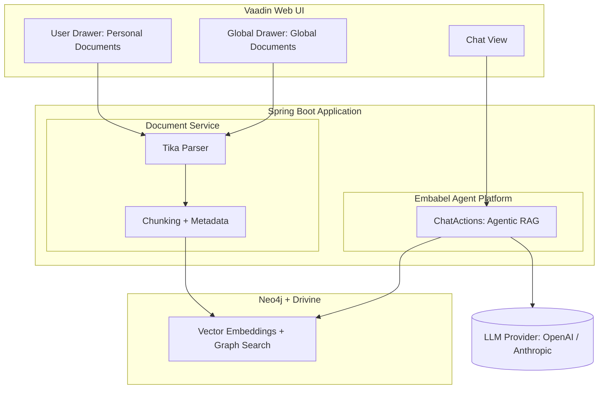
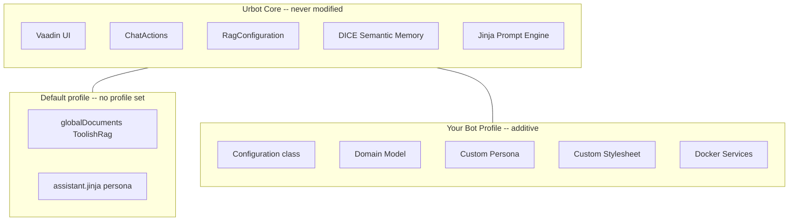

&nbsp;&nbsp;&nbsp;&nbsp;

&nbsp;&nbsp;&nbsp;&nbsp;

# Urbot

> **Template repository** -- Use this as a starting point for building your own RAG chatbot with the [Embabel Agent Framework](https://embabel.com). Click **"Use this template"** on GitHub to create your own copy.

**A RAG-powered document chatbot with a Vaadin web interface, built on the [Embabel Agent Framework](https://github.com/embabel/embabel-agent).**

Upload documents, ask questions, and get intelligent answers grounded in your content -- powered by agentic Retrieval-Augmented Generation with Neo4j graph-backed vector search and [DICE](https://github.com/embabel/dice) semantic memory.

Urbot is designed to be **extended without modification**. The core application provides the full RAG infrastructure, Vaadin UI, memory system, and chat plumbing out of the box. To build your own chatbot, you add a [Spring profile](https://docs.spring.io/spring-boot/reference/features/profiles.html) with your persona, domain model, tools, and styling -- all in a separate package, without touching any existing code. See [Extensibility](#extensibility) below.

<p align="center">
  
  <br>
  <em>The Astrid chatbot (running on the <a href="https://github.com/embabel/urbot/tree/astrid">astrid branch</a>) recalls that Cassie has a cat named Artemis -- a fact learned from uploaded files and conversation, stored as typed entities in the knowledge graph.</em>
</p>

---

## Architecture



## How Agentic RAG Works

Unlike traditional RAG pipelines where retrieval is a fixed preprocessing step, Urbot uses the **Embabel Agent Framework's Utility AI pattern** to make retrieval _agentic_. The LLM autonomously decides when and how to search your documents.


Key aspects of the agentic approach:

- **Autonomous tool use** -- The LLM decides _whether_ to search and _what_ to search for
- **Iterative retrieval** -- Multiple searches can refine results before answering
- **Context-aware filtering** -- Results are scoped to the user's current workspace context
- **Template-driven prompts** -- Jinja2 templates separate persona, objective, and guardrails

## Document Contexts and Memory

Urbot has two document scopes for RAG and a separate memory system for learning facts about users.

### Document Ingestion

| Scope | Access | Ingestion | Description |
|---|---|---|---|
| **Personal** | Per-user context | User Drawer (click profile) | Documents scoped to a user's named context (e.g. `2_personal`). Users can create and switch between multiple contexts. |
| **Global** | Shared across all users | Global Drawer (`...` toggle) | Documents available to everyone, stored under the `global` context. |

RAG search filters results to the user's current effective context, so personal and global documents are searched independently based on which context is active. See [`DocumentService`](src/main/java/com/embabel/urbot/rag/DocumentService.java) for the ingestion implementation and [`RagConfiguration`](src/main/java/com/embabel/urbot/rag/RagConfiguration.java) for the store setup.

### Memory: Learning Facts with "Learn"

The **Learn** button in the Memory tab lets users upload files (PDF, DOCX, TXT, etc.) to extract structured facts about themselves. Unlike document ingestion for RAG (which chunks and embeds documents for search), Learn runs the [DICE](https://github.com/embabel/dice) proposition extraction pipeline:

1. **Parse** -- Tika extracts text from the uploaded file
2. **Extract** -- The LLM identifies propositions (factual claims) from the text
3. **Resolve** -- Mentions in propositions are resolved to named entities in the knowledge graph
4. **Project** -- Semantic relationships between entities are extracted and stored as graph edges

This creates a rich knowledge graph of facts about the user. For example, uploading a bio might extract "Alice lives in Hobart", "Alice owns a cat named Artemis", "Alice likes Big Thief" -- each linked to typed entities (`Place`, `Pet`, `Band`) in Neo4j.

The same pipeline also runs incrementally on conversation messages: every few turns, [DICE](https://github.com/embabel/dice) extracts propositions from the chat window, so the bot progressively learns about the user through natural conversation.

See [`IncrementalPropositionExtraction`](src/main/java/com/embabel/urbot/proposition/extraction/IncrementalPropositionExtraction.java) for the extraction flow and [`PropositionConfiguration`](src/main/java/com/embabel/urbot/proposition/PropositionConfiguration.java) for the pipeline wiring.

<p align="center">
  
  <br>
  <em>The Memory tab in the User Drawer showing 68 propositions extracted from uploaded files and conversation, clustered by topic. Each cluster groups related facts -- here about Cassie's pet Artemis, her gardening, cooking, and podcast habits.</em>
</p>

**Entity extraction requires domain model interfaces.** Without `NamedEntity` subinterfaces (like `Pet`, `Place`, `Band`), DICE has no schema to guide extraction and will only extract untyped propositions. See [Domain Model](#3-domain-model-namedentity-interfaces) below.

## Technology Stack

| Layer | Technology | Role |
|---|---|---|
| **UI** | [Vaadin 24](https://vaadin.com/) | Server-side Java web framework with real-time push updates |
| **Backend** | [Spring Boot 3](https://spring.io/projects/spring-boot) | Application framework, dependency injection, security |
| **Agent Framework** | [Embabel Agent](https://github.com/embabel/embabel-agent) | Agentic AI orchestration with Utility AI pattern |
| **Semantic Memory** | [DICE](https://github.com/embabel/dice) | Proposition extraction, entity resolution, knowledge graph projection |
| **Graph + Vector Store** | [Neo4j](https://neo4j.com/) via [Drivine](https://github.com/liberation-data/drivine) | Graph-backed vector embeddings, semantic search, and document relationships |
| **Document Parsing** | [Apache Tika](https://tika.apache.org/) | Extract text from PDF, DOCX, HTML, and 1000+ formats |
| **LLM** | OpenAI / Anthropic | Chat completion and text embedding models |
| **Auth** | Spring Security | Form-based authentication with role-based access |

### Embabel Agent Framework

Urbot is built on the [Embabel Agent Framework](https://github.com/embabel/embabel-agent), which provides:

- **`AgentProcessChatbot`** -- Wires actions into a conversational agent using the Utility AI pattern, where the LLM autonomously selects which `@Action` methods to invoke
- **`ToolishRag`** -- Exposes vector search as an LLM-callable tool, enabling agentic retrieval
- **`DrivineStore`** -- Neo4j-backed RAG store with vector indexes and graph relationships (Lucene and pgvector backends are also available)
- **Jinja2 prompt templates** -- Composable system prompts with persona/objective/guardrails separation

### Vaadin UI

The frontend is built entirely in server-side Java using Vaadin Flow:

- [`ChatView`](src/main/java/com/embabel/urbot/vaadin/ChatView.java) -- Main chat interface with message bubbles, markdown rendering, and real-time tool call progress indicators
- [`UserDrawer`](src/main/java/com/embabel/urbot/vaadin/UserDrawer.java) -- Click the profile chip to manage personal documents, switch contexts, view memory and entities, and log out
- [`GlobalDrawer`](src/main/java/com/embabel/urbot/vaadin/GlobalDrawer.java) -- Right-side toggle panel for uploading and managing global documents
- **Dark theme** -- Custom Lumo theme with responsive design
- **Push updates** -- Async responses stream to the browser via long polling

### Neo4j Vector Store

Documents are chunked, embedded, and stored in Neo4j via Drivine:

- **Chunking** -- 800-character chunks with 100-character overlap for context continuity
- **Embeddings** -- Generated via OpenAI `text-embedding-3-small` (configurable)
- **Metadata filtering** -- Chunks tagged with user/context metadata for scoped search
- **Graph relationships** -- Document → section → chunk hierarchy preserved as graph edges
- **Persistent storage** -- Neo4j container via Docker Compose, survives restarts

## Features

- **Document upload** -- PDF, DOCX, XLSX, TXT, MD, HTML, ODT, RTF (up to 10MB)
- **URL ingestion** -- Fetch and index web pages directly
- **Personal & global documents** -- Personal documents scoped per user context; global documents shared across all users
- **Multi-context workspaces** -- Create and switch between named contexts to organize personal documents
- **Learn from files** -- Upload files to extract structured facts about the user via DICE proposition extraction
- **Entity extraction** -- Automatically identifies and types entities (people, places, organizations, etc.) from conversation and uploaded files
- **Markdown chat** -- Responses render with full markdown and code highlighting
- **Tool call visibility** -- See real-time progress as the agent searches your documents
- **Session persistence** -- Conversation history preserved across page reloads
- **Configurable persona** -- Switch voice and objective via configuration
- **Custom chatbot profiles** -- Activate a Spring profile to replace the entire persona, domain model, tools, and RAG configuration

## Extensibility

Urbot is an extensible template. You never need to modify the core application code -- instead, you add your own package alongside it and activate it with a [Spring profile](https://docs.spring.io/spring-boot/reference/features/profiles.html). The base application provides RAG infrastructure, Vaadin UI, [DICE](https://github.com/embabel/dice) semantic memory, and chat plumbing; your profile adds a persona, domain model, tools, stylesheet, and `ToolishRag` configuration to create an entirely different chatbot.

When no profile is set, the `default` profile is active and Urbot runs as a generic document Q&A assistant with the built-in `globalDocuments` `ToolishRag` bean. When a profile is activated, that default bean is skipped (via `@Profile("default")`) and the profile's `@Configuration` class provides its own `ToolishRag` and any other beans it needs.

### How It Works

All extensibility flows through **Spring bean auto-discovery**. [`ChatActions`](src/main/java/com/embabel/urbot/ChatActions.java) is injected with `List<LlmReference>` and `List<Tool>` -- Spring collects every bean of those types from the entire application context. So any `Tool`, `LlmReference`, `ToolishRag`, or `Subagent` bean you define in your bot's `@Configuration` class is automatically available to the LLM during chat, with no explicit wiring required.

Similarly, [`PropositionConfiguration`](src/main/java/com/embabel/urbot/proposition/PropositionConfiguration.java) collects all `DataDictionary` and `Relations` beans and merges them with `@Primary` composite beans, so your domain model and relationships are automatically incorporated into the extraction pipeline.

Bot packages are discovered at startup by [`BotPackageScanConfiguration`](src/main/java/com/embabel/urbot/BotPackageScanConfiguration.java), which scans the packages listed in `urbot.bot-packages` using Spring's `ClassPathBeanDefinitionScanner`.



### Extension Axes

Each custom chatbot lives in its own package (e.g. `com.embabel.bot.astrid`) and can extend Urbot along these axes:

| Axis | Mechanism | Example |
|---|---|---|
| **Properties** | [`application-<profile>.properties`](https://docs.spring.io/spring-boot/reference/features/external-config.html#features.external-config.files.profile-specific) overrides persona, objective, LLM model, temperature, stylesheet | `urbot.chat.persona=astrid` |
| **Persona & Objective** | Jinja templates in `prompts/personas/<name>.jinja` and `prompts/objectives/<name>.jinja` | Astrid's warm astrologer voice |
| **Domain Model** | `NamedEntity` subinterfaces scoped via `urbot.bot-packages` -- automatically added to the [DICE](https://github.com/embabel/dice) data dictionary for entity extraction | `Pet`, `Band`, `Goal`, `Place` |
| **Relationships** | A `Relations` bean defines how entities connect (e.g. user _owns_ Pet, user _listens to_ Band) | `Relations.empty().withSemanticBetween(...)` |
| **Tools** | `@LlmTool` classes, `Subagent` beans, `ToolishRag` beans -- all auto-discovered via [Spring component scanning](https://docs.spring.io/spring-framework/reference/core/beans/classpath-scanning.html) | `AstrologyTools`, `DailyHoroscopeAgent` |
| **ToolishRag** | Profile-specific `ToolishRag` bean replaces the default `globalDocuments` | `astrologyDocuments` scoped to global context |
| **Users** | `@Primary UrbotUserService` bean overrides the default user list | Different demo users per bot |
| **Stylesheet** | `urbot.stylesheet=<name>` loads `themes/urbot/<name>.css` | Custom color palette and branding |
| **Docker services** | Profile-specific compose services (e.g. an astrology API container) | `docker compose --profile astrology up` |

### 1. Properties

Create `application-<profile>.properties` in `src/main/resources` to override any `urbot.*` property when the profile is active. Spring Boot's [profile-specific property files](https://docs.spring.io/spring-boot/reference/features/external-config.html#features.external-config.files.profile-specific) are merged on top of the base `application.yml` -- profile values win.

Key properties:

| Property | Description | Default |
|----------|-------------|---------|
| `urbot.chat.persona` | Persona template name (`prompts/personas/<name>.jinja`) | `assistant` |
| `urbot.chat.objective` | Objective template (`prompts/objectives/<name>.jinja`) | `qa` |
| `urbot.chat.llm.model` | Chat LLM model ID | `gpt-4.1-mini` |
| `urbot.chat.llm.temperature` | LLM temperature | `0.0` |
| `urbot.chat.max-words` | Soft response length limit | `80` |
| `urbot.bot-packages` | Packages to scan for bot components | _(none)_ |
| `urbot.memory.enabled` | Enable DICE memory extraction | `true` |
| `urbot.stylesheet` | CSS override (`themes/urbot/<name>.css`) | _(none)_ |

See [`UrbotProperties`](src/main/java/com/embabel/urbot/UrbotProperties.java) for the full configuration record.

### 2. Templates

Add Jinja templates to `src/main/resources/prompts/` to define the bot's voice and goals:

```
prompts/
  personas/<botname>.jinja      # Personality, tone, style
  objectives/<botname>.jinja    # What the bot should accomplish
  behaviours/<botname>.jinja    # Optional behavioural rules
```

Templates have access to `properties` ([`UrbotProperties`](src/main/java/com/embabel/urbot/UrbotProperties.java)) and `user` ([`UrbotUser`](src/main/java/com/embabel/urbot/user/UrbotUser.java)) via the Jinja context, and can include shared elements like ``.

### 3. Domain Model: NamedEntity Interfaces

Domain entities are defined as **Java interfaces extending `NamedEntity`**. This is a deliberate design choice:

- **Schema generation** -- [DICE](https://github.com/embabel/dice) generates JSON schema from the interface to guide LLM extraction
- **Graph hydration** -- Neo4j nodes are hydrated to typed instances via dynamic proxies, so there's no need for concrete classes
- **Composability** -- An entity can implement multiple interfaces (e.g. a node with labels `Person` and `Author` implements both)

Simple entities need only extend `NamedEntity`:

```java
public interface Band extends NamedEntity {}
public interface Place extends NamedEntity {}
```

Entities with properties add getters with `@JsonPropertyDescription`:

```java
public interface Pet extends NamedEntity {
    @JsonPropertyDescription("Type of pet, e.g. \"dog\", \"cat\"")
    String getType();
}
```

Entities with relationships use `@Relationship`:

```java
public interface Person extends NamedEntity {
    @Relationship(name = "HAS_VISITED")
    List<Place> hasVisited();

    @Relationship(name = "LIVES_IN")
    Place livesIn();
}
```

**Without entity interfaces, you won't get typed entity extraction.** The LLM needs a schema to know what kinds of things to look for. If no `NamedEntity` subinterfaces are defined, DICE will only extract untyped propositions without resolving mentions to typed entities in the knowledge graph.

Entity interfaces are discovered automatically from `urbot.bot-packages`. They are scanned by [`PropositionConfiguration`](src/main/java/com/embabel/urbot/proposition/PropositionConfiguration.java), which calls `NamedEntity.dataDictionaryFromPackages(...)` to build the `DataDictionary` that guides extraction.

### 4. Relationships

A `Relations` bean defines how entities connect. Spring auto-composes all `Relations` beans via a `@Primary` composite in [`PropositionConfiguration`](src/main/java/com/embabel/urbot/proposition/PropositionConfiguration.java), so your relations merge with the base set.

```java
@Bean
Relations myBotRelations() {
    return Relations.empty()
            .withSemanticBetween("UrbotUser", "Pet", "owns", "user owns a pet")
            .withSemanticBetween("UrbotUser", "Place", "lives_in", "user lives in a place")
            .withSemanticBetween("UrbotUser", "Band", "listens_to", "user listens to a band");
}
```

Relations serve two purposes: they guide DICE's graph projection (converting propositions into typed relationships in Neo4j) and they help the `MemoryProjector` classify knowledge by type (semantic, temporal, causal).

### 5. Tools and References

Any `Tool`, `LlmReference`, `ToolishRag`, or `Subagent` bean in your `@Configuration` is automatically picked up by [`ChatActions`](src/main/java/com/embabel/urbot/ChatActions.java). No explicit wiring needed -- Spring's `List<Tool>` and `List<LlmReference>` injection collects them all.

```java
@Bean
LlmReference astrologyDocuments(SearchOperations searchOperations) {
    return new ToolishRag("astrology_docs",
            "Shared astrology documents",
            searchOperations)
            .withMetadataFilter(new PropertyFilter.Eq("context", "global"))
            .withUnfolding();
}

@Bean
Subagent dailyHoroscope() {
    return Subagent.ofClass(DailyHoroscopeAgent.class)
            .consuming(DailyHoroscopeAgent.HoroscopeRequest.class);
}
```

### Example: Astrid (Astrology Chatbot)

The [`astrid`](https://github.com/embabel/urbot/tree/astrid) branch demonstrates a complete custom chatbot built entirely through the extension model:

```bash
git checkout astrid
mvn spring-boot:run -Dspring-boot.run.profiles=astrid
```

The astrid branch adds:

| Component | What it provides |
|---|---|
| `AstridConfiguration` | `Relations` bean, `ToolishRag` for astrology docs, `DailyHoroscopeAgent` subagent, custom users |
| `AstrologyTools` | `@LlmTool` methods wrapping a Swiss Ephemeris API for natal charts and transits |
| Domain interfaces (`Pet`, `Band`, `Book`, `Goal`, `Place`, `Person`, `Author`, `Food`, `Hobby`) | Typed entity extraction from conversation -- DICE learns about pets, music taste, travel history, etc. |
| `astrid.jinja` persona | An Australian astrologer who speaks casually and believes the stars explain life |
| `astrid.css` | Custom dark theme with astrology-inspired colors |
| `application-astrid.properties` | Persona, objective, high temperature (1.38), bot package, stylesheet |

The domain interfaces in the astrid branch are the key enabler for rich memory. When a user says "I have a cat named Artemis", DICE:
1. Extracts the proposition "User owns a cat named Artemis"
2. Resolves "Artemis" to a `Pet` entity (because `Pet extends NamedEntity` exists in the schema)
3. Creates the graph relationship `(User)-[:OWNS]->(Pet {name: "Artemis", type: "cat"})` (because `Relations` defines `withSemanticBetween("UrbotUser", "Pet", "owns", ...)`)

Without the `Pet` interface, DICE would still extract the proposition but wouldn't create a typed entity or relationship.

<p align="center">
  
  <br>
  <em>The knowledge graph in Neo4j after DICE extraction. Cassie Silver (center) is connected to people she knows (Priya), musicians she listens to (Adrianne Lenker, Elliott Smith, Joni Mitchell, Nick Drake), authors she loves (Ursula Le Guin), and languages she plays (Esperanto) -- all typed relationships extracted from conversation and uploaded files.</em>
</p>

### Creating Your Own Bot

1. Create a package under `src/main/java/com/embabel/bot/<yourbot>/`
2. Add a `@Configuration` class (gated with `@Profile("<yourbot>")`) with your beans -- tools, `ToolishRag`, domain relations, users
3. Add domain interfaces extending `NamedEntity` for entity types you want extracted
4. Add `application-<yourbot>.properties` with `urbot.bot-packages=com.embabel.bot.<yourbot>` and your persona/objective names
5. Add Jinja templates under `prompts/personas/` and `prompts/objectives/`
6. Run with `mvn spring-boot:run -Dspring-boot.run.profiles=<yourbot>`

See [`src/main/java/com/embabel/bot/README.md`](src/main/java/com/embabel/bot/README.md) for the full extension reference.

## Project Structure

```
src/main/java/
├── com/embabel/urbot/               # Core application
│   ├── UrbotApplication.java           # Spring Boot entry point + Drivine bootstrap
│   ├── BotPackageScanConfiguration.java # Plugin discovery via urbot.bot-packages
│   ├── ChatActions.java                # @Action methods for agentic RAG chat
│   ├── ChatConfiguration.java          # Utility AI chatbot wiring
│   ├── UrbotProperties.java            # Externalized configuration
│   ├── rag/
│   │   ├── RagConfiguration.java       # Neo4j/Drivine vector store + default ToolishRag
│   │   └── DocumentService.java        # Document ingestion, context management
│   ├── proposition/
│   │   ├── PropositionConfiguration.java    # DICE pipeline: schema, relations, extractors
│   │   └── extraction/
│   │       └── IncrementalPropositionExtraction.java  # Learn + conversation extraction
│   ├── security/
│   │   ├── SecurityConfiguration.java  # Spring Security setup
│   │   └── LoginView.java              # Login page
│   ├── user/
│   │   ├── UrbotUser.java              # User model (implements NamedEntity + Person)
│   │   └── UrbotUserService.java       # User service interface
│   └── vaadin/
│       ├── ChatView.java               # Main chat interface
│       ├── ChatMessageBubble.java      # User/assistant message rendering
│       ├── GlobalDrawer.java           # Global document management panel
│       ├── UserDrawer.java             # Personal docs + context selector + memory + entities
│       ├── MemorySection.java          # Memory tab with Learn upload + propositions
│       ├── EntitiesSection.java        # Entities tab showing context-scoped entities
│       ├── PropositionsPanel.java      # Proposition list with clustering
│       ├── EntityPanel.java            # Single entity card renderer
│       ├── DocumentListSection.java    # Document list component
│       ├── FileUploadSection.java      # File upload component (reusable)
│       ├── UrlIngestSection.java       # URL ingestion component (reusable)
│       ├── UserSection.java            # Clickable user profile chip
│       └── Footer.java                 # Document/chunk statistics
└── com/embabel/bot/                  # Custom chatbot profiles (profile-gated)
    └── <yourbot>/                      # e.g. astrid/
        ├── <YourBot>Configuration.java # @Configuration with tools, ToolishRag, domain relations
        ├── <YourBot>Tools.java         # @LlmTool methods
        └── domain/                     # NamedEntity subinterfaces for DICE extraction

src/main/resources/
├── application.yml                     # Base config (server, LLM, Neo4j, chunking)
├── application-<profile>.properties    # Profile overrides (persona, objective, bot-packages)
└── prompts/
    ├── urbot.jinja                     # Main prompt template
    ├── elements/
    │   ├── guardrails.jinja            # Safety guidelines
    │   └── personalization.jinja       # Dynamic persona/objective loader
    ├── personas/
    │   ├── assistant.jinja             # Default assistant persona
    │   └── <yourbot>.jinja             # Custom persona per profile
    └── objectives/
        ├── general.jinja               # Default knowledge base objective
        └── <yourbot>.jinja             # Custom objective per profile

docker-compose.yml                      # Neo4j + optional profile-specific services
```

## Getting Started

### Prerequisites

- Java 21+
- Maven 3.9+
- Docker (for Neo4j)
- An OpenAI or Anthropic API key
- (Optional) A [Brave Search API key](https://brave.com/search/api/) for web search via MCP

### Run (Default Mode)

```bash
# Start Neo4j
docker compose up -d

# Set your API key
export OPENAI_API_KEY=sk-...    # or ANTHROPIC_API_KEY for Claude

# Optional: enable Brave web search MCP tool
export BRAVE_API_KEY=BSA...

# Start the application (default generic document Q&A assistant)
mvn spring-boot:run
```

To run with a custom chatbot profile instead:

```bash
mvn spring-boot:run -Dspring-boot.run.profiles=astrid
```

Open [http://localhost:9000](http://localhost:9000) and log in:

| Username | Password | Roles |
|---|---|---|
| `admin` | `admin` | ADMIN, USER |
| `user` | `user` | USER |

### Upload Documents and Chat

1. Click your **profile chip** (top right) to open the personal documents drawer -- upload files or paste URLs scoped to your current context
2. Click the **`...` toggle** on the right edge to open the global documents drawer -- uploads here are shared across all users
3. Use the **Learn** button in the Memory tab to upload files for fact extraction -- DICE will extract propositions and build a knowledge graph about you
4. Ask questions -- the agent will search your documents and memories to synthesize answers

## Configuration

All settings are in `src/main/resources/application.yml`:

```yaml
urbot:
  chunker-config:
    max-chunk-size: 800       # Characters per chunk
    overlap-size: 100         # Overlap between chunks
    embedding-batch-size: 800

  chat-llm:
    model: gpt-4.1-mini      # LLM for chat responses
    temperature: 0.0          # Deterministic responses

  voice:
    persona: assistant        # Prompt persona template
    max-words: 250            # Target response length

  objective: general          # Prompt objective template

embabel:
  models:
    default-llm:
      model: gpt-4.1-mini
    default-embedding-model:
      model: text-embedding-3-small

# Neo4j connection (matches docker-compose.yml)
database:
  datasources:
    neo:
      type: NEO4J
      host: localhost
      port: 7891
      user-name: neo4j
      password: urbot123
```

LLM provider is selected automatically based on which API key is set:
- `OPENAI_API_KEY` activates OpenAI models
- `ANTHROPIC_API_KEY` activates Anthropic Claude models

### MCP Tools

Urbot supports [MCP (Model Context Protocol)](https://modelcontextprotocol.io/) tools, which are automatically discovered from configured MCP servers and made available to the LLM during chat.

**Brave Search** is included by default. To enable it:

1. Get an API key from [brave.com/search/api](https://brave.com/search/api/) (free tier available)
2. Set `BRAVE_API_KEY` in your environment
3. Ensure Docker is running (the Brave MCP server runs as a container)

Additional MCP servers can be added under `spring.ai.mcp.client.stdio.connections` in `application.yml`. Any tools they expose will automatically be available to the chatbot.

## References

### Embabel Projects

| Project | Description |
|---|---|
| [**Embabel Agent Framework**](https://github.com/embabel/embabel-agent) | Agentic AI orchestration with Utility AI pattern, tool use, and prompt management |
| [**DICE**](https://github.com/embabel/dice) | Proposition extraction, entity resolution, semantic memory, and knowledge graph projection |

### Example Applications

| Project | Description |
|---|---|
| [**Ragbot**](https://github.com/embabel/rag-demo) | CLI + web RAG chatbot demonstrating the core agentic RAG pattern with multiple personas and pluggable vector stores |
| [**Impromptu**](https://github.com/embabel/impromptu) | Classical music discovery chatbot with Spotify/YouTube integration, Matryoshka tools, and DICE semantic memory |

### Spring Concepts Used

| Concept | How Urbot uses it |
|---|---|
| [**Spring Profiles**](https://docs.spring.io/spring-boot/reference/features/profiles.html) | Activate bot-specific configuration without modifying core code |
| [**Externalized Configuration**](https://docs.spring.io/spring-boot/reference/features/external-config.html) | Profile-specific `.properties` files override base `application.yml` settings |
| [**Component Scanning**](https://docs.spring.io/spring-framework/reference/core/beans/classpath-scanning.html) | [`BotPackageScanConfiguration`](src/main/java/com/embabel/urbot/BotPackageScanConfiguration.java) discovers beans in `urbot.bot-packages` |
| [**List Injection**](https://docs.spring.io/spring-framework/reference/core/beans/dependencies/factory-autowire.html) | [`ChatActions`](src/main/java/com/embabel/urbot/ChatActions.java) collects all `Tool` and `LlmReference` beans automatically |
| [**`@Primary` Composites**](https://docs.spring.io/spring-framework/reference/core/beans/dependencies/factory-collaborators.html#beans-autowired-annotation-primary) | [`PropositionConfiguration`](src/main/java/com/embabel/urbot/proposition/PropositionConfiguration.java) merges all `DataDictionary` and `Relations` beans |

## License

Apache 2.0 -- Copyright 2024-2026 Embabel Software, Inc.
