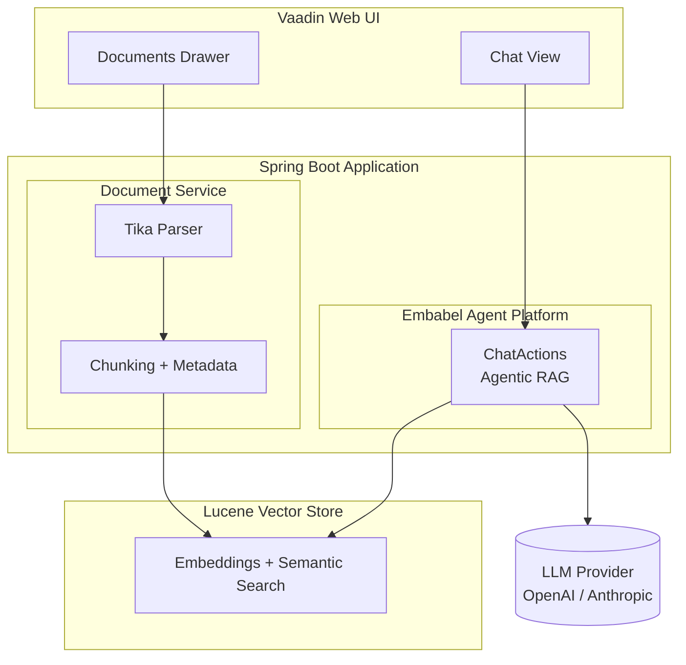
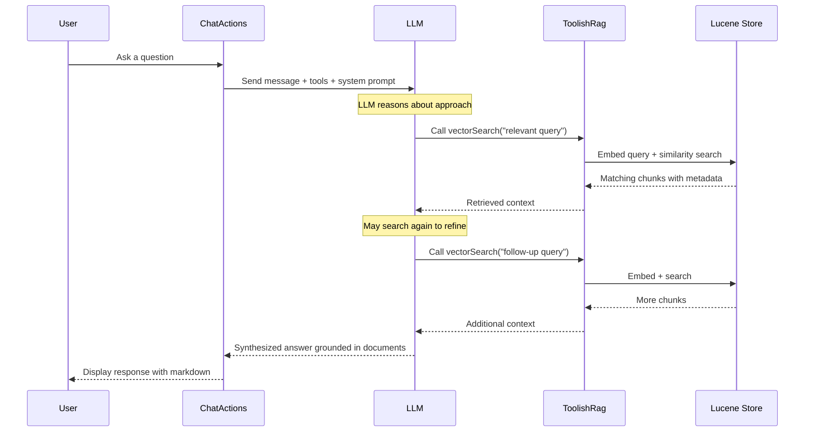

&nbsp;&nbsp;&nbsp;&nbsp;

&nbsp;&nbsp;&nbsp;&nbsp;

# Urbot

> **Template repository** -- Use this as a starting point for building your own RAG chatbot with the [Embabel Agent Framework](https://embabel.com). Click **"Use this template"** on GitHub to create your own copy.

**A RAG-powered document chatbot with a Vaadin web interface, built on the [Embabel Agent Framework](https://embabel.com).**

Upload documents, ask questions, and get intelligent answers grounded in your content -- powered by agentic Retrieval-Augmented Generation with Apache Lucene vector search.

---

## Architecture



## How Agentic RAG Works

Unlike traditional RAG pipelines where retrieval is a fixed preprocessing step, Urbot uses the **Embabel Agent Framework's Utility AI pattern** to make retrieval _agentic_. The LLM autonomously decides when and how to search your documents.



Key aspects of the agentic approach:

- **Autonomous tool use** -- The LLM decides _whether_ to search and _what_ to search for
- **Iterative retrieval** -- Multiple searches can refine results before answering
- **Context-aware filtering** -- Results are scoped to the user's current workspace context
- **Template-driven prompts** -- Jinja2 templates separate persona, objective, and guardrails

## Technology Stack

| Layer | Technology | Role |
|---|---|---|
| **UI** | [Vaadin 24](https://vaadin.com/) | Server-side Java web framework with real-time push updates |
| **Backend** | [Spring Boot 3](https://spring.io/projects/spring-boot) | Application framework, dependency injection, security |
| **Agent Framework** | [Embabel Agent](https://embabel.com) | Agentic AI orchestration with Utility AI pattern |
| **Vector Search** | [Apache Lucene](https://lucene.apache.org/) | Disk-persisted vector embeddings and semantic search |
| **Document Parsing** | [Apache Tika](https://tika.apache.org/) | Extract text from PDF, DOCX, HTML, and 1000+ formats |
| **LLM** | OpenAI / Anthropic | Chat completion and text embedding models |
| **Auth** | Spring Security | Form-based authentication with role-based access |

### Embabel Agent Framework

Urbot is built on the [Embabel Agent Framework](https://embabel.com), which provides:

- **`AgentProcessChatbot`** -- Wires actions into a conversational agent using the Utility AI pattern, where the LLM autonomously selects which `@Action` methods to invoke
- **`ToolishRag`** -- Exposes vector search as an LLM-callable tool, enabling agentic retrieval
- **`LuceneSearchOperations`** -- Pluggable RAG backend (Lucene, pgvector, and Neo4j are also available)
- **Jinja2 prompt templates** -- Composable system prompts with persona/objective/guardrails separation

### Vaadin UI

The frontend is built entirely in server-side Java using Vaadin Flow:

- **ChatView** -- Main chat interface with message bubbles, markdown rendering, and real-time tool call progress indicators
- **DocumentsDrawer** -- Slide-out panel for uploading files, ingesting URLs, and managing documents
- **Dark theme** -- Custom Lumo theme with responsive design
- **Push updates** -- Async responses stream to the browser via long polling

### Lucene Vector Store

Documents are chunked, embedded, and indexed in a local Lucene store:

- **Chunking** -- 800-character chunks with 100-character overlap for context continuity
- **Embeddings** -- Generated via OpenAI `text-embedding-3-small` (configurable)
- **Metadata filtering** -- Chunks tagged with user/context metadata for scoped search
- **Persistent index** -- Stored at `./.lucene-index/`, survives restarts

## Features

- **Document upload** -- PDF, DOCX, XLSX, TXT, MD, HTML, ODT, RTF (up to 10MB)
- **URL ingestion** -- Fetch and index web pages directly
- **Multi-context workspaces** -- Organize documents into separate searchable contexts
- **Markdown chat** -- Responses render with full markdown and code highlighting
- **Tool call visibility** -- See real-time progress as the agent searches your documents
- **Session persistence** -- Conversation history preserved across page reloads
- **Configurable persona** -- Switch voice and objective via configuration

## Project Structure

```
src/main/java/com/embabel/urbot/
├── UrbotApplication.java        # Spring Boot entry point
├── ChatActions.java                 # @Action methods for agentic RAG chat
├── ChatConfiguration.java           # Utility AI chatbot wiring
├── RagConfiguration.java            # Lucene vector store setup
├── DocumentService.java             # Document ingestion and management
├── UrbotProperties.java          # Externalized configuration
├── security/
│   ├── SecurityConfiguration.java   # Spring Security setup
│   └── LoginView.java               # Login page
├── user/
│   ├── UrbotUser.java            # User model with context
│   └── UrbotUserService.java     # User service interface
└── vaadin/
    ├── ChatView.java                # Main chat interface
    ├── ChatMessageBubble.java       # User/assistant message rendering
    ├── DocumentsDrawer.java         # Document management panel
    ├── DocumentListSection.java     # Document list component
    ├── FileUploadSection.java       # File upload component
    ├── UrlIngestSection.java        # URL ingestion component
    ├── UserSection.java             # User profile and context selector
    └── Footer.java                  # Document/chunk statistics

src/main/resources/
├── application.yml                  # Server, LLM, and chunking config
└── prompts/
    ├── urbot.jinja               # Main prompt template
    ├── elements/
    │   ├── guardrails.jinja         # Safety guidelines
    │   └── personalization.jinja    # Dynamic persona/objective loader
    ├── personas/
    │   └── assistant.jinja          # Default assistant persona
    └── objectives/
        └── general.jinja            # General knowledge base objective
```

## Getting Started

### Prerequisites

- Java 21+
- Maven 3.9+
- An OpenAI or Anthropic API key

### Run

```bash
export OPENAI_API_KEY=sk-...    # or ANTHROPIC_API_KEY for Claude

mvn spring-boot:run
```

Open [http://localhost:9000](http://localhost:9000) and log in:

| Username | Password | Roles |
|---|---|---|
| `admin` | `admin` | ADMIN, USER |
| `user` | `user` | USER |

### Upload Documents and Chat

1. Click the documents icon to open the side panel
2. Upload files or paste a URL to ingest
3. Ask questions -- the agent will search your documents and synthesize answers

## Configuration

All settings are in `src/main/resources/application.yml`:

```yaml
urbot:
  chunker-config:
    max-chunk-size: 800       # Characters per chunk
    overlap-size: 100         # Overlap between chunks
    embedding-batch-size: 800

  chat-llm:
    model: gpt-4.1-mini      # LLM for chat responses
    temperature: 0.0          # Deterministic responses

  voice:
    persona: assistant        # Prompt persona template
    max-words: 250            # Target response length

  objective: general          # Prompt objective template

embabel:
  models:
    default-llm:
      model: gpt-4.1-mini
    default-embedding-model:
      model: text-embedding-3-small
```

LLM provider is selected automatically based on which API key is set:
- `OPENAI_API_KEY` activates OpenAI models
- `ANTHROPIC_API_KEY` activates Anthropic Claude models

## Related Projects

Urbot is one of several example applications built on the Embabel Agent Framework:

| Project | Description |
|---|---|
| **[Ragbot](https://github.com/embabel/rag-demo)** | CLI + web RAG chatbot demonstrating the core agentic RAG pattern with multiple personas and pluggable vector stores |
| **[Impromptu](https://github.com/embabel/impromptu)** | Classical music discovery chatbot with Spotify/YouTube integration, Matryoshka tools, and DICE semantic memory |

## License

Apache 2.0 -- Copyright 2024-2025 Embabel Software, Inc.
